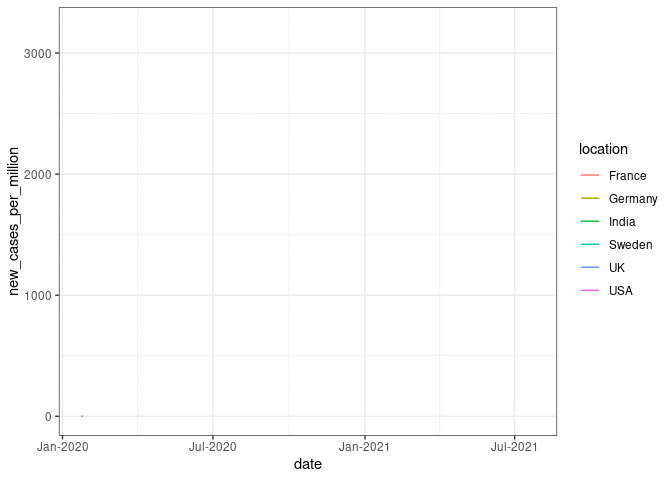

```{r, include=FALSE}
hooks = knitr::knit_hooks$get()
hook_foldable = function(type) {
  force(type)
  function(x, options) {
    res = hooks[[type]](x, options)
    
    if (isFALSE(options[[paste0("fold.", type)]])) return(res)
    
    paste0(
      "<details><summary>", type, "</summary>\n\n",
      res,
      "\n\n</details>"
    )
  }
}
knitr::knit_hooks$set(
  output = hook_foldable("output"),
  plot = hook_foldable("plot")
)
```

```{r,echo=FALSE,child="assets/header-lab.Rmd"}
```

<!-- ------------ Only edit title, subtitle & author above this ------------ -->

```{r,echo=FALSE,results='hide',warning=FALSE,message=FALSE}
library(shiny)
library(ggplot2)
library(dplyr)
library(tidyverse)
```

In this section of the lab, we will try to go into making an app step-by-step. The idea basically is to first have a plan/backbone of the page that we want and then to go on populating the page in a step-wise manner!

# Aesthetics

There is one part of the shiny app that could also be argued as the important part of an Rshiny app is its aesthetics. We will not cover any of this in the course unfortunately as there will be no time, if we go into it. But there are many tutorials and exercises to learn this part. I will list some of the sources where you can learn how to make your app look pretty and nice.

* Here is a [link][1] from the webinar series of Rstudio explaining the different aspects of the aesthetics in the shiny app that you can work on!

* This is a similar tutorial how to write a [calendar app][2] given at [NBIS RaukR course][3]

* [Shiny themes][4] that you can use after you set everything


[1]:https://vimeo.com/rstudioinc/review/131218530/212d8a5a7a/#t=1h32m41s
[2]:https://nbisweden.github.io/RaukR-2021/shiny/lab/shiny_lab.html#12_Calendar_app
[3]:https://nbisweden.github.io/RaukR-2021/
[4]:https://rstudio.github.io/shinythemes/

# Covid App

In the following steps, we will try to make an app that is basically on the data available on the current pandemic and the vaccinations from [Our world in Data][5]. Here, we basically want to choose the data available from 6 different countries that are: `France`, `Germany`, `India`, `Sweden`, `UK` and `USA`. We would also like to give the option to choose which date range that one would like to visualize between `2020-02-15` to `2021-07-25`. 

**Topics covered**

- UI layout using pre-defined function (pageWithSidebar)
- Input and output widgets and reactivity
- Use of date-time
- Customized ggplot
- Download image files
- Update inputs using observe
- Validating inputs with custom error messages

Below is the quick view of the app that we are aiming to achieve:

**Add the preview image here**

[5]:https://ourworldindata.org/covid-vaccinations

# Data structure

First let us take a quick look at the data and how it is formatted. For this exercise we will use the file `shiny_app_data.csv`.  

```{r}
cov_data <- read.table("data/shiny_app_data.csv", sep = ",", header = T)
head(cov_data)
```

It is a simple comma-separated file with 6 columns: `location`, `date`, `new_cases_per_million`, `new_deaths_per_million`, `icu_patients_per_million` and `people_vaccinated_per_hundred`. Now, the idea is that we will use the first two columns as input values where user can choose the countries and the date range for which they would like to see how the pandemic was and then we make the four plots accordingly! For making these animated plots in the app, we would need the following packages: `shiny`, `gganimate`, `colourpicker` and `shinythemes`.

# Example plot

Now let us take a quick look at how to make one of these plots! The following code should produce a similar plot as below:

```{r, eval=FALSE}
library(gganimate)
library(ggplot2)
cov_data %>%
  ggplot(aes(x= date, y=new_cases_per_million, group = location, color = location)) +
  geom_line() +
  geom_point() +
  theme_bw() +
  scale_x_date(date_labels = "%b-%Y") +
  transition_reveal(date)
```



# Building the app

Now, let us go ahead and start building the app! 

## Layout
We need to first have a plan for the app page, which UI elements to include and how they will be laid out and structured. My plan is as shown in the preview image.

**Add the preview image here**

There is a horizontal top bar for the title and two columns below. The left column will contain the input widgets and control. The right column will contain the plot output. Since, this is a commonly used layout, it is available as a predefined function in shiny called `pageWithSidebar()`. It takes three arguments `headerPanel`, `sidebarPanel` and `mainPanel` which is self explanatory.

```{r, eval = FALSE}
shinyApp(
ui=fluidPage(
  pageWithSidebar(
    headerPanel(),
    sidebarPanel(),
    mainPanel())
  ),
server=function(input,output){}
)
```

## UI

Then we fill in the panels with widgets and contents.


